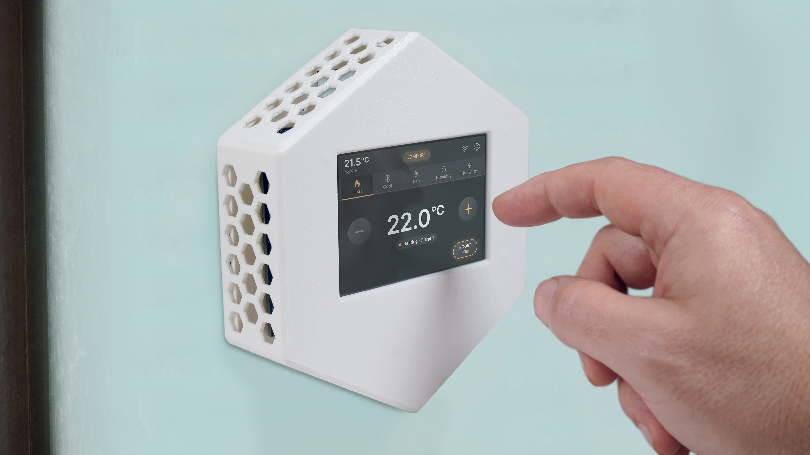
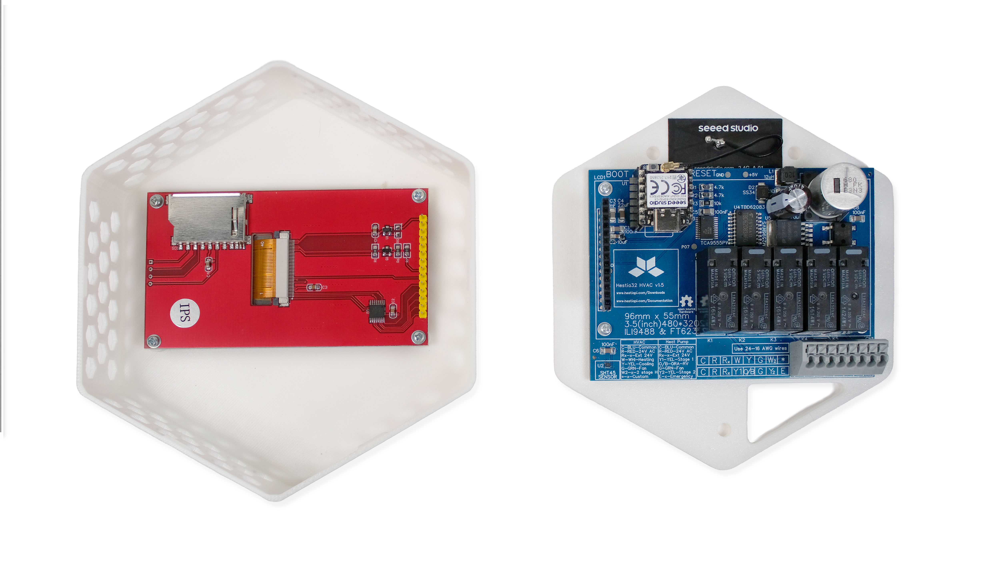
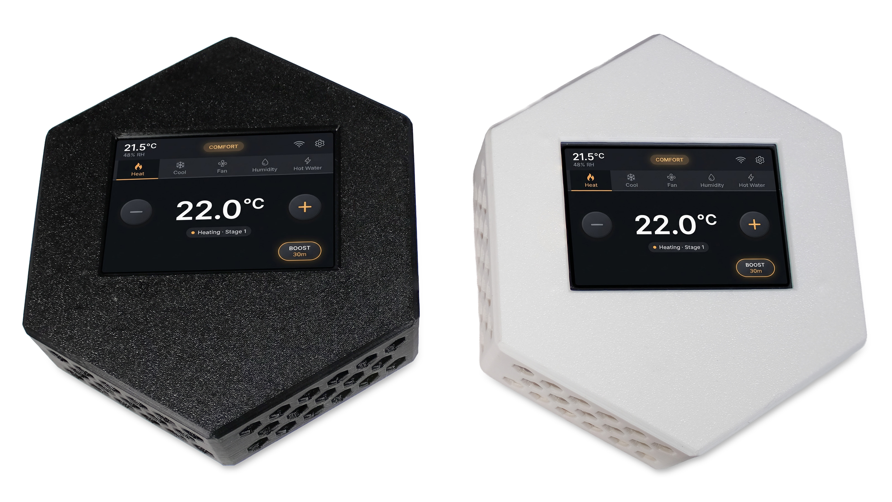

# Hestia32

[](https://github.com/MakeOpenStuff/hestia32/actions/workflows/build.yml)
[](https://github.com/MakeOpenStuff/hestia32/actions)



ESP32 firmware with WiFi provisioning, OTA updates, ILI9488 display, resistive touch and factory reset support.

## Hestia32 is currently in pre-launch on Crowd Supply.
[Follow the campaign →](https://www.crowdsupply.com/makeopenstuff/hestia32)




## Supported Hardware

- **ESP32-C5** - RISC-V based ESP32 variant
- **ILI9488 Display** - 3.5" 320x480 IPS display with XPT2046 resistive touch

## Features

### HVAC Control
- **Multi-stage thermostat logic** - Separate control for heating, cooling, and hot water domains
- **Stage 2 support** - Progressive power control with time-delay and deviation thresholds
- **Comfort and ECO modes** - Adjustable temperature deadbands (±0.5°C comfort, ±1.0°C eco)
- **Hysteresis protection** - 5-minute delay prevents rapid mode switching
- **Fan pre/post-run** - Ensures airflow before heating elements activate and distributes residual heat/cool
- **Open-window detection** - Automatically suspends heating on rapid temperature drops to save energy

### Per-Domain Boost Feature
- Temporarily override thermostat logic for heating, cooling, or hot water
- Maximum output for user-defined countdown period
- Independent boost timer and duration memory per domain
- Automatic return to normal operation when boost expires

### Hardware & UI
- **3.5" ILI9488 Display** (320x480 IPS) with resistive touch (XPT2046)
- **LVGL-based graphical interface** with smooth animations
- **Automatic touch calibration** on first boot
- **Resistive touch coordinate mapping** for accurate input
- **Configurable sensor input** (SHT45 temperature/humidity)
- **5× SPST-NO dry-contact relay outputs** — shared common terminal plus five independent returns; activating a relay shorts its return to common (wire common to R in HVAC systems or N in EU mains wiring)

### Communication & Provisioning
- **WiFi provisioning** via web interface in AP (access point) mode
- **OTA (Over-The-Air) firmware updates** with stable/develop channel selection
- **Multiple protocol support:**
  - **MQTT** (fully implemented, production-ready)
  - **Zigbee** (protocol stub, framework ready)
  - **Matter** (protocol stub, framework ready)
- **Configurable node name and OTA server URL**
- **Factory reset** via BOOT button long-press (5 seconds)
- **NVS persistent storage** for WiFi credentials, calibration, and user settings

### Hardware Variants
- **ESP32-C5 RISC-V** - Primary target (full support)
- **Multiple board profiles:**
  - DevKit (standard GPIO pin assignment)
  - XIAO (compact form factor, alternative pins)
- **Regional variants:**
  - EU (European power levels and configurations)
  - HVAC (heating/cooling optimized)



## Prerequisites

### Display Hardware (ESP32-C5)
- **ILI9488 3.5" IPS Display** (320x480 resolution)
- **XPT2046 Touch Controller** (resistive)
- See [WIRING.md](WIRING.md) for complete pin connections
- **Important:** Display MISO must be disconnected - GPIO 2 is dedicated to touch controller

### For ESP32 (PlatformIO)
- [PlatformIO](https://platformio.org/) installed
- USB drivers for your ESP32 board

### For ESP32-C5 (ESP-IDF v5.5)
- ESP-IDF v5.5.2 or later (official C5 support)
- Python 3.8+
- CMake 3.16+
- Ninja build system

### For Testing (Native Host)
- GCC or Clang compiler with C11 support
- Make (optional, for convenient build commands)

## Building and Flashing

### Clone Repository

**Important:** This project uses git submodules (LVGL). Always clone with `--recursive`:

```bash
# Clone with submodules
git clone --recursive https://github.com/MakeOpenStuff/hestia32.git
cd hestia32

# Or if you already cloned without --recursive:
git submodule update --init --recursive
```

### ESP32 (NodeMCU-32S) - PlatformIO

```bash
# Build
pio run -e nodemcu-32s

# Upload
pio run -e nodemcu-32s -t upload

# Monitor
pio device monitor
```

### ESP32-C5 - Native ESP-IDF

#### First Time Setup

```bash
# Clone ESP-IDF v5.5.2 (one time only)
cd ~/esp
git clone --recursive --branch v5.5.2 https://github.com/espressif/esp-idf.git esp-idf-v5.5

# Install ESP-IDF tools for ESP32-C5 (one time only)
cd ~/esp/esp-idf-v5.5
./install.sh esp32c5
```

#### Protocol Selection

Hestia32 supports multiple communication protocols. Choose one when building:

**MQTT over WiFi (Default - Fully Implemented)**
```bash
idf.py -D SDKCONFIG_DEFAULTS=sdkconfig.mqtt build
```

**Zigbee (Stub Only - Not Yet Implemented)**
```bash
idf.py -D SDKCONFIG_DEFAULTS=sdkconfig.zigbee build
```

**Matter (Stub Only - Not Yet Implemented)**
```bash
idf.py -D SDKCONFIG_DEFAULTS=sdkconfig.matter build
```

You can also select the protocol interactively:
```bash
idf.py menuconfig
# Navigate to: Hestia32 Configuration → Communication Protocol
```

To check which protocol is currently selected:
```bash
grep "CONFIG_HESTIA32_PROTOCOL" sdkconfig
```

#### Build Commands

```bash
# Set up environment (required in each new terminal session)
source ~/esp/esp-idf-v5.5/export.sh

# Or use the provided script
./setup-c5.sh

# Configure target (first time only)
idf.py set-target esp32c5

# Build firmware
idf.py build

# Erase flash (removes all data including WiFi credentials)
idf.py -p /dev/ttyUSB0 erase-flash

# Flash firmware
idf.py -p /dev/ttyUSB0 flash

# Monitor serial output
idf.py -p /dev/ttyUSB0 monitor

# Flash and monitor in one command
idf.py -p /dev/ttyUSB0 flash monitor
```

**Note:** Replace `/dev/ttyUSB0` with your actual serial port (e.g., `/dev/ttyACM0`, `COM3` on Windows, `/dev/cu.usbserial-*` on macOS). Also prefer the (upper) port labelled UART (avoid USB or Native).

## Testing

### Thermostat Logic Tests

The firmware includes a comprehensive test suite for the thermostat control logic that runs on your development machine (not on the ESP32).

#### Running Tests

```bash
# Quick test (using Makefile)
make test

# Or manually build and run
gcc -Wall -Wextra -std=c11 -I. src/thermostat.c tests/test_thermostat.c -o test_thermostat -lm && ./test_thermostat
```

#### Test Coverage

The test suite validates:

1. **Configuration validation** - Domain limits, setpoint sanity checks
2. **Hysteresis protection** - Prevents rapid state changes (300s delay)
3. **Comfort deadband** - Temperature activation thresholds (±0.5°C)
4. **ECO deadband** - Wider temperature band for energy savings (±1.0°C)
5. **Stage 2 heating** - Gradual power increase with delay + deviation logic
6. **Stage 2 cooling** - Gradual power increase with delay + deviation logic
7. **Mutual exclusion** - Heating and cooling never run simultaneously
8. **Sensor failure safety** - Automatic shutdown on sensor faults
9. **Temperature units** - Celsius and Fahrenheit conversion
10. **Fan control** - Pre-run (30s), post-run (60s), and manual override
11. **Humidity control** - Humidification and dehumidification with deadband
12. **Hot water demand** - On-demand hot water heating
13. **Fan timing** - Comprehensive pre-run and post-run validation
14. **Hysteresis + HVAC** - State change delays with fan coordination
15. **Comfort deadband + HVAC** - Temperature thresholds with fan safety
16. **ECO deadband + HVAC** - Energy-saving mode with fan coordination
17. **Stage 2 heating + HVAC** - Multi-stage heating with fan timing
18. **Stage 2 cooling + HVAC** - Multi-stage cooling with fan timing
19. **Mutual exclusion + HVAC** - No simultaneous operation through all fan phases
20. **Sensor failure + HVAC** - Immediate shutdown including fan (safety critical)
21. **Open window detection** - Detects rapid temperature drops, suspends heating to save energy
22. **Open window false positive prevention** - Validates gradual changes don't trigger detection

**Scenario Testing:**
- **24-hour simulation** - Complete heating cycle with realistic temperature changes

**Key Features Validated:**
- Fan pre-run ensures airflow before thermal elements activate (prevents dry running)
- Fan post-run distributes residual heat/cool after thermal stops
- Minimum cycle time (180s) protects equipment from short cycling
- Hysteresis period (300s) prevents rapid mode switching
- Stage 2 activation requires both time delay (300s) AND temperature deviation (0.75°C)
- All outputs shut down immediately on sensor failure (safety)
- Manual fan override works independently of thermal state

#### Test Output

Tests produce color-coded output (green = pass, red = fail) with:
- Related configuration for each test
- Step-by-step execution traces
- Final summary table with pass/fail counts

```
=== TEST 1: Configuration Validation ===
Testing: thermostat_config_validate() with various invalid configs
...
✓ PASSED: Configuration Validation

=== SUMMARY ===
Total Tests: 12
Passed: 12
Failed: 0
Success Rate: 100.00%
```

#### Continuous Testing

Run tests before committing changes to ensure thermostat logic correctness:


## Usage

### Initial Setup (Provisioning)

1. Flash the firmware to your device
2. On first boot, the device creates a WiFi access point:
	 - **SSID:** `HESTIA32`
	 - **Password:** None (open network)
3. Connect to the `HESTIA32` WiFi network
4. Open a web browser and navigate to `http://192.168.4.1`
5. Enter your WiFi credentials and configuration:
	 - WiFi SSID
	 - WiFi Password
	 - Node Name (optional)
	 - OTA Server URL (optional)
6. Click Save - the device will restart and connect to your WiFi

### Factory Reset

To erase WiFi credentials, touch calibration, and return to provisioning mode:

1. Power off the device
2. Press and hold the **BOOT** button
3. Power on the device (or press RESET while holding BOOT)
4. Keep holding the BOOT button for **5 seconds**
5. Release when you see "Factory reset confirmed!" in the serial monitor
6. The device will erase all NVS data and reboot into provisioning mode

**BOOT Button GPIO:**
- ESP32 (original): GPIO 0
- ESP32-C5: GPIO 28

**Troubleshooting:** Check serial monitor for "BOOT button GPIO X level: 0" when button is pressed. If it shows "1", the GPIO may be incorrect for your board.

## Configuration

Edit `src/config.h` to customize:

```c
#define PROV_AP_SSID "HESTIA32"          // Provisioning AP name
#define PROV_AP_PASSWORD ""               // AP password (empty = open)
#define OTA_SERVER_URL "https://..."      // Default OTA server
#define OTA_CHECK_INTERVAL_MS 300000      // OTA check interval (5 min)
#define APP_VERSION "1.0.0"               // Firmware version
```

## Project Structure

```
hestia32/
├── src/
│   ├── main.c                      # Application entry point
│   ├── core/                       # Core thermostat & hardware functionality
│   │   ├── core_config.h           # Firmware version and core settings
│   │   ├── thermostat.c/h          # HVAC control logic (stages, hysteresis, deadbands)
│   │   ├── relay_manager.c/h       # Heating, cooling, hot water, fan output control
│   │   ├── sensor_sht45.c/h        # Temperature/humidity sensor interface
│   │   ├── protocol_manager.c/h    # Protocol abstraction and selection
│   │   ├── user_settings.c/h       # NVS persistent storage (WiFi, calibration, settings)
│   │   ├── display_manager.h       # Display abstraction layer
│   │   ├── display_ui.h            # LVGL UI components and screens
│   │   └── display_config.h        # Display initialization (ILI9488, XPT2046)
│   └── protocols/                  # Communication protocol implementations
│       ├── protocol_interface.h    # Common interface for all protocols
│       ├── mqtt/                   # MQTT over WiFi (production-ready)
│       │   ├── mqtt_protocol.c/h   # MQTT client and message handling
│       │   ├── wifi_manager.c/h    # WiFi connection management
│       │   ├── wifi_provisioning.c/h # Web-based provisioning (AP mode)
│       │   ├── ota_manager.c/h     # OTA update checking and flashing
│       │   ├── mqtt_config.h       # MQTT broker configuration
│       │   └── provisioning_html.h # Embedded provisioning web UI
│       ├── zigbee/                 # Zigbee (protocol stub)
│       │   └── protocol_zigbee.c/h
│       └── matter/                 # Matter (protocol stub)
│           └── protocol_matter.c/h
├── components/
│   ├── esp_lcd_ili9488/            # ILI9488 display driver
│   └── lvgl/                       # LVGL graphics library (submodule)
├── pcb/                            # Hardware designs and manufacturing files
│   └── README.md                   # PCB revision history and board notes
├── docs/                           # Technical documentation
│   ├── display/                    # Display configuration guides
│   ├── esp32-c5/                   # ESP32-C5 specific documentation
│   └── sensors/                    # Sensor integration docs
├── tests/
│   ├── test_thermostat.c           # Comprehensive thermostat logic test suite (24 tests)
│   └── Makefile                    # Test build automation
├── platformio.ini                  # PlatformIO configuration (ESP32 support)
├── CMakeLists.txt                  # ESP-IDF build config (ESP32-C5 primary)
├── sdkconfig.defaults              # ESP-IDF default settings
├── sdkconfig.mqtt/zigbee/matter    # Protocol-specific SDK configurations
├── Makefile                        # Build and test automation
├── setup-c5.sh                     # ESP32-C5 environment setup script
├── WIRING.md                       # Complete pin mapping for all board variants
├── Hestia32-FSD.md                 # Functional specification document
└── README.md                       # This file
```

## Troubleshooting

### ESP32-C5 Build Issues

**Error: `idf.py: command not found`**
```bash
source ~/esp/esp-idf-v5.5/export.sh
```

**Error: WiFi/PHY undefined references**
- Make sure you're using ESP-IDF v5.5.1 or later
- ESP32-C5 support is incomplete in earlier versions

**Error: unexpected command options**
- Use plain `idf.py` commands with no extra preview options

### Serial Port Not Found

```bash
# Linux - check available ports
ls /dev/tty*

# Add user to dialout group (Linux)
sudo usermod -a -G dialout $USER
# Log out and back in for changes to take effect

# macOS - check available ports
ls /dev/cu.*
```

### Device Stuck in Provisioning Mode

If the device won't connect to WiFi after provisioning:

1. Check serial monitor for error messages
2. Verify WiFi credentials are correct
3. Perform factory reset and re-provision
4. Check that your WiFi network is 2.4GHz (ESP32 doesn't support 5GHz)

### Test Failures

If thermostat tests fail:

1. Check that you have a C11-compatible compiler:
	 ```bash
	 gcc --version  # Should be 4.9 or later
	 ```

2. Ensure all source files are present:
	 ```bash
	 ls src/thermostat.c src/thermostat.h tests/test_thermostat.c
	 ```

3. Run with verbose output to see which test failed:
	 ```bash
	 ./build/test_thermostat
	 ```

4. If colors don't display correctly, your terminal may not support ANSI codes

## TODO

### Known Issues & Pending Tasks

- [ ] **WiFi Model**
	- [ ] Fix serial logging on DevKit - Serial output stops after bootloader on ESP32-C5 DevKit, investigate USB re-enumeration or UART configuration
	- [ ] Verify SHT45 operation on DevKit - Confirm sensor reads correctly with swapped I2C pins (SDA=GPIO5, SCL=GPIO4)
	- [ ] Update WIRING.md pinout diagram - Reconcile conflicting GPIO assignments in DevKit pinout diagram vs. connection tables
	- [ ] Update Project Structure section - Reflect current codebase organization with display, relay, and sensor modules
- [ ] **UI Design & Implementation**
	- [ ] Design and implement main thermostat control interface
	- [ ] Create settings/configuration screens
	- [ ] Implement touch interactions and navigation
	- [ ] Add visual feedback for heating/cooling states
- [ ] **Zigbee Model**
- [ ] **Matter Model**

## License

This project uses a dual-license model:

- **Code and firmware** (e.g. `src/`, `components/`, build scripts) are licensed under **GNU General Public License v3.0 (GPL-3.0)**. See `LICENSE`.
- **Documentation and hardware artifacts** (e.g. `*.md`, `pcb/`, schematics, manufacturing outputs, media) are licensed under **Creative Commons Attribution-ShareAlike 4.0 International (CC BY-SA 4.0)**. See `LICENSE-CC-BY-SA-4.0.md`.

Third-party dependencies keep their own licenses.
